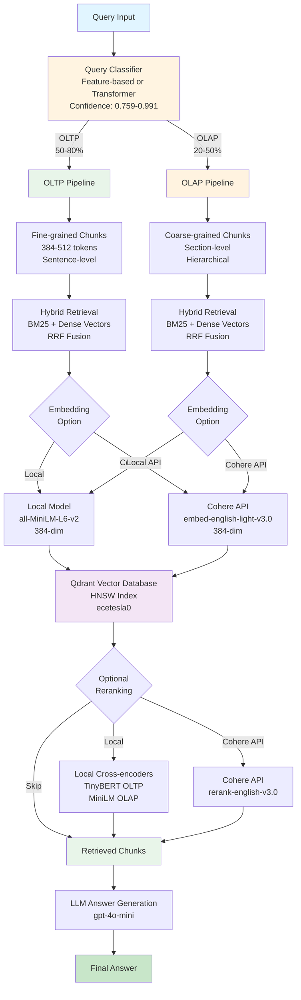
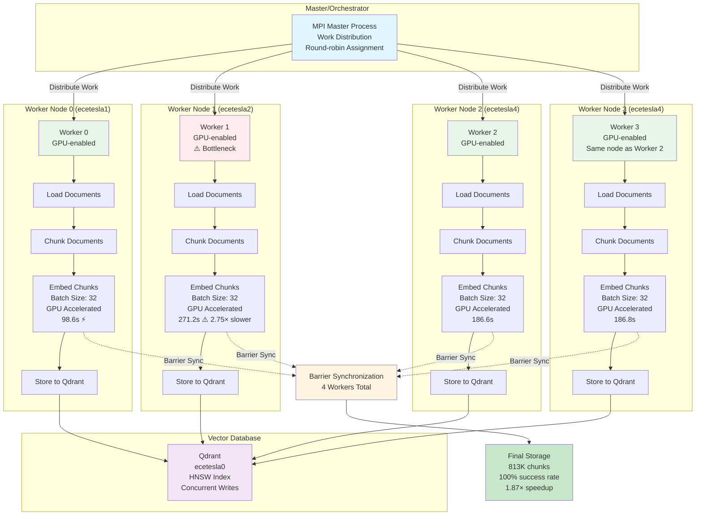
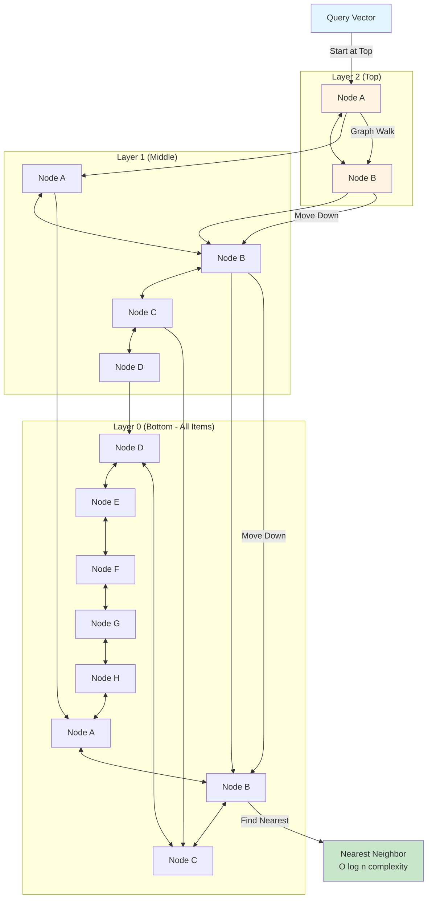
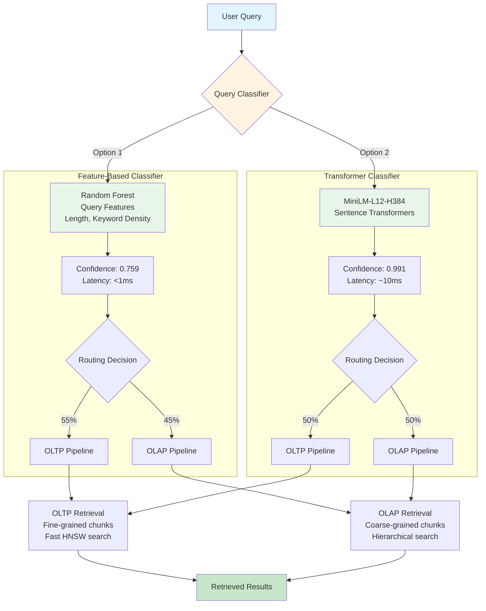
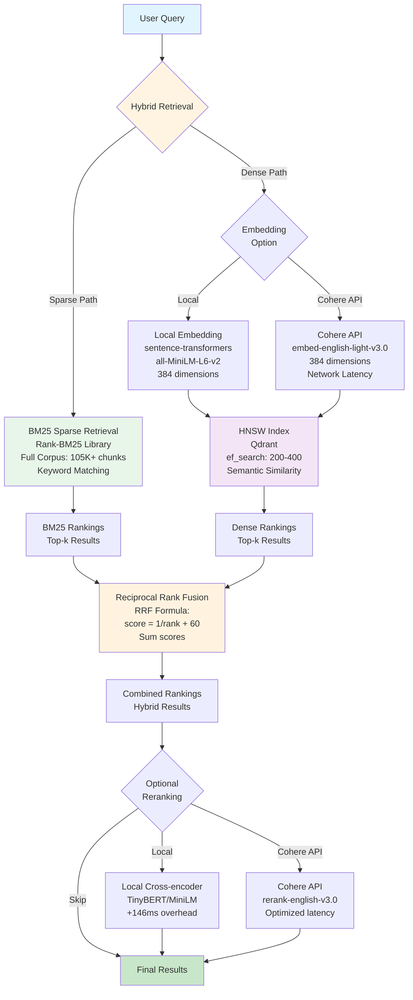
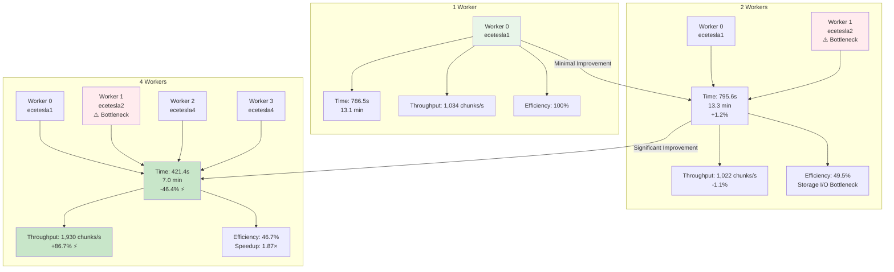

# Mermaid Diagrams for Presentation Slides

This file contains Mermaid code for all architecture and system diagrams needed for the presentation slides.

---

## 1. System Architecture Diagram (Slide 6)



---

## 2. Distributed Ingestion Architecture (Slide 12)



---

## 3. HNSW Graph Illustration (Slide 8)



---

## 4. Query Routing Flow Diagram (Slide 9)



---

## 5. Hybrid Retrieval Architecture (Slide 11)



---

## 6. Cohere API vs Local Models Comparison (Slide 17B)

```mermaid
graph LR
    subgraph "Local Models"
        Local_Config[Configuration:<br/>transformer_hybrid_rerank]
        Local_MRR[MRR: 0.454]
        Local_Recall[Recall@10: 0.273]
        Local_NDCG[NDCG@10: 0.456]
        Local_Latency[Latency: 305.0ms]
        
        Local_Config --> Local_MRR
        Local_Config --> Local_Recall
        Local_Config --> Local_NDCG
        Local_Config --> Local_Latency
    end
    
    subgraph "Cohere API"
        Cohere_Config[Configuration:<br/>transformer_hybrid_rerank]
        Cohere_MRR[MRR: 0.482<br/>+6%]
        Cohere_Recall[Recall@10: 0.595<br/>+118% ⭐]
        Cohere_NDCG[NDCG@10: 0.520<br/>+14%]
        Cohere_Latency[Latency: 184.7ms<br/>-39% ⚡]
        
        Cohere_Config --> Cohere_MRR
        Cohere_Config --> Cohere_Recall
        Cohere_Config --> Cohere_NDCG
        Cohere_Config --> Cohere_Latency
    end
    
    Local_MRR -.->|Improvement| Cohere_MRR
    Local_Recall -.->|+118%| Cohere_Recall
    Local_NDCG -.->|+14%| Cohere_NDCG
    Local_Latency -.->|39% faster| Cohere_Latency
    
    style Local_Config fill:#e8f5e9
    style Cohere_Config fill:#fff3e0
    style Cohere_Recall fill:#c8e6c9
    style Cohere_Latency fill:#c8e6c9
```

---

## 7. Scaling Results Visualization (Slide 14)



---

## Usage Instructions

1. **For Markdown/HTML**: Copy the Mermaid code blocks into your markdown file or HTML page with a Mermaid renderer.

2. **For PowerPoint/Google Slides**: 
   - Use online Mermaid editors (https://mermaid.live/) to generate SVG/PNG
   - Export and insert into slides

3. **For LaTeX/Beamer**: 
   - Use `mermaid` package or convert to TikZ
   - Or export as PNG and include as image

4. **Customization**: 
   - Adjust colors by modifying `style` blocks
   - Modify node labels and connections as needed
   - Add/remove nodes based on your specific needs

---

## Notes

- All diagrams use consistent color schemes:
  - Blue (#e1f5ff): Input/Query nodes
  - Yellow (#fff4e1): Decision/Classifier nodes
  - Green (#e8f5e9): Processing nodes
  - Purple (#f3e5f5): Database/Storage nodes
  - Light Green (#c8e6c9): Output/Final nodes
  - Red (#ffebee): Bottleneck/Warning nodes

- Diagrams are designed to be clear and readable in presentation format
- Adjust sizes and layouts as needed for your slide dimensions

